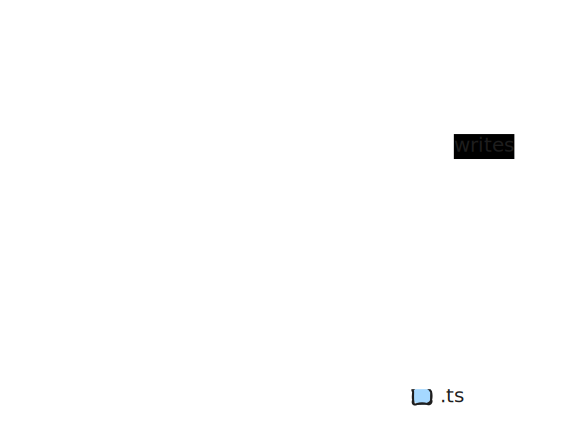

# CC-TODO-Task

Eine interaktive To-Do Liste für eine Webanwendung entwickelt, um Nutzer das Hinzufügen, Bearbeiten, Abschließen, und Löschen von Aufgaben zu ermöglichen. Geschrieben in `TypeScript`, `HTML`, `CSS` mit Hilfe des `Svelte` Frameworks.

*NOTIZ: Repo für die CyberCurriculum Programmieraufgabe.*


## Setup
Die folgenden Schritte habe ich verwendet, um die Anwendung, wie sie im Repo hinterlegt ist, lokal zum Laufen zu kriegen.
Wenn es bessere Wege gibt, können diese natürlich verwendet werden.

```bash
# Clone Repository
git clone https://github.com/saqr98/CC-TODO-Task.git

# Move to todo app/
cd CC-TODO-Task/todo\ app

# Run build script (requires exectuable permission)
./script.sh
```

Alternativ können die Schritte aus dem Build-Skript auch manuell ausgeführt werden.

```bash
# Install package dependencies
npm install

# Build app. Alternatively, just run as developer `npm run dev`
npm run build

# Preview App
npm run preview
```

## Vorgehensweise
Ausgehend von unten stehender Aufgabenstellung beschreibe ich hier kurz wie ich zum Lösen der gestellten Aufgabe vorgegangen bin. 

Weil mir die Syntax des `Svelte`-Frameworks zusagte und ich die auf [Svelte](https://svelte.dev) beschriebenen Konzepte einleuchtend fand, habe ich mich dazu entschieden die Aufgabe mit diesem anzufertigen. Zum Start habe ich ein einfaches Template für eine `Svelt`-Seite verwendet. Zur besseren Nachvollziehbarkeit, hier der dafür verwendete Command.

```bash
# Create project from template
npm create vite@latest

# Select `Svelte` framework
# Select 'TypeScript' as variant
```

### Modell
#### Grundgerüst
Das Fundament des Datenmodells bildet eine `TypeScript` Schnittstelle (Interface) namens `ITask`. Dies beschreibt die Attribute, die ein Task besitzen kann, d.h. eine eindeutige Identifikationsnummer `id` , eine Beschreibung des zu erledigenden Tasks `todo`, und den binären Bearbeitungsstatus des Tasks `done`. Jede `Task` Komponente hat damit den Datentypen `ITask`. Über die Dateninhalte hinaus besteht eine `Task` Komponente aus einem **HTML** `input`-Element des Typs `checkbox`, dem dazugehörigen `label`, und einem `button` zum Löschen einess bestimmten `Tasks`. Erstellte `Tasks` werden intern als `ITask[]` Liste in einer `TaskList` Komponente zusammengefasst und gemeinsam graphisch dargestellt.

Final angezigt wird die `TaskList` Komponente dann erst in der Hauptansicht der Seite in `App.svelte`.

#### Datenspeicherung
Damit die Seite auf Veränderungen in der Nutzeroberfläche reagieren kann, wird ein schreibares `ITask[]` Objekt in `store.ts` erstellt, das sowohol `Task.svelte` als auch `TaskList.svelte` abonnieren, und damit lesen und beschreiben können.
Hierfür verwendet die Anwendung das Konzept der `stores`, das `Svelte` zur Verfügung stellt, um Veränderungen sobald sie auftreten an Abonnenten zu kommunizieren. Ebenfalls abonniert wird dieses Objekt von `store.ts` damit es jegliche Veränderungen in den lokalen Speicher (`localStorage`) schreiben kann. Hierbei wird immer eine Liste `ITask[]` im lokalen Speicher abgelegt.




## Aufgabenstellung
Du sollst eine interaktive To-Do Liste für eine Webanwendung entwickeln. Diese Liste ermöglicht es den Nutzern, Aufgaben hinzuzufügen, zu bearbeiten, abzuschließen und zu löschen. Die Anwendung soll mit `TypeScript`, `HTML`, `CSS` implementiert werden. Ob du ein Framework, wie `React` oder `Svelte` benutzt, steht dir frei.

### Anforderungen
#### Erstellen einer einfachen Benutzeroberfläche
- Ein Textfeld zum Hinzufügen neuer Aufgaben.
- Ein Button zum Hinzufügen der Aufgabe zur Liste.
- Eine Liste, die alle hinzugefügten Aufgaben anzeigt.
- Für jede Aufgabe soll es eine Checkbox zum Markieren geben, wenn sie abgeschlossen ist.
- Für jede Aufgabe soll es einen Button zum Löschen der Aufgabe geben.

#### Interaktive Funktionalität
- **Hinzufügen von Aufgaben:** Beim Klick auf den "Hinzufügen"-Button soll die Aufgabe zur Liste hinzugefügt werden.
- **Markieren von Aufgaben als erledigt:** Beim Klick auf das Checkbox-Element soll der Status der Aufgabe zwischen "erledigt" und "offen" umgeschaltet werden (dargestellt durch das Durchstreichen des Textes und das Anpassen der Farbe der Aufgabe).
- **Löschen von Aufgaben:** Beim Klick auf den Löschen-Button soll die entsprechende Aufgabe aus der Liste entfernt werden.

#### Datenhaltung
- Die Aufgaben sollen im `localStorage` des Browsers gespeichert werden, sodass die Liste beim Neuladen der Seite nicht verloren geht.
- Der Status einer Aufgabe (offen oder erledigt) soll ebenfalls im `localStorage` gespeichert werden.

#### Validierung
- Das Hinzufügen einer Aufgabe soll nur dann möglich sein, wenn das Textfeld nicht leer ist.
- Wenn der Benutzer versucht, eine leere Aufgabe hinzuzufügen, soll eine entsprechende Fehlermeldung angezeigt werden.